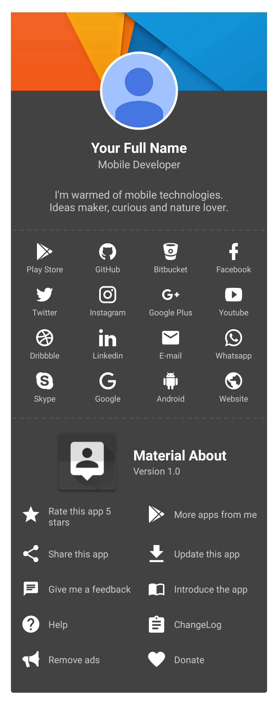
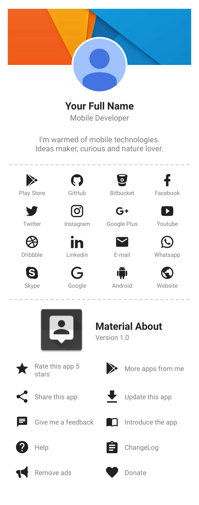
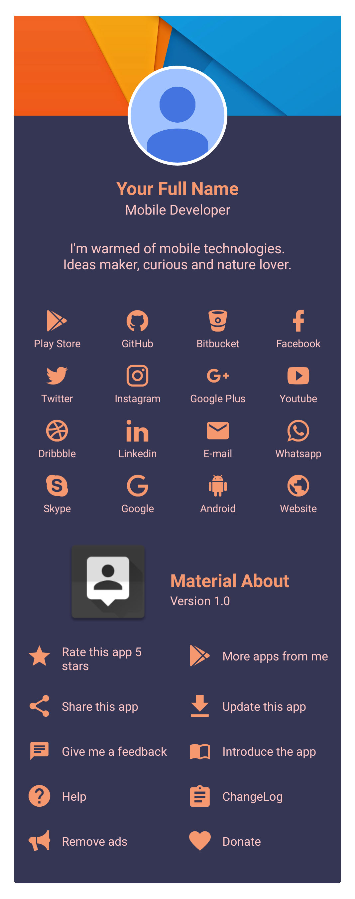

<!-- Library Logo -->


<!-- Buy me a cup of coffe -->
<a href='https://ko-fi.com/A406JCM' style='margin:13px;' target='_blank' align="right"></a>
<a href='https://play.google.com/store/apps/details?id=com.vansuita.materialabout.sample&pcampaignid=MKT-Other-global-all-co-prtnr-py-PartBadge-Mar2515-1' target='_blank' align="right"></a>
# Material About


This is an [**Android**](https://developer.android.com) project. You, as a mobile developer, can use this library to show a material about screen in your apps.
It was built to make your life easier when introducing you to your users, and also, to create an about screen pattern for material android apps. It's really simple and dynamic, check it out.

</br>

##### Note: If you're missing some feature please let me know. Or even better, create a pull request. Also, I'm needing some help to translate the strings.xml to other languages.

##### Supported Languages: 🇺🇸 🇧🇷 🇪🇸 🇮🇹 🇷🇺 🇩🇪 :cn: :tr: 🇺🇦 🇫🇷 🇦🇪 🇰🇷

</br>

<!-- JitPack integration -->
[](https://jitpack.io/#jrvansuita/MaterialAbout)
[](https://android-arsenal.com/details/1/4614) [](https://www.uplabs.com/posts/material-about) 

# Sample app
 This library has a lot more customization and features than is able to show here. Please check the sample app and feel free to help with a pull request. You can take a look at the sample app [located on this project](/app/).



[](https://appetize.io/embed/3b4dpd5kv90mpa67mp5h8mugc0?device=nexus7&scale=50&autoplay=true&orientation=portrait&deviceColor=black) [](http://apk-dl.com/dl/com.vansuita.materialabout.sample) 
 [](https://www.codacy.com/app/jrvansuita/MaterialAbout?utm_source=github.com&amp;utm_medium=referral&amp;utm_content=jrvansuita/MaterialAbout&amp;utm_campaign=Badge_Grade) 
 <a target="_blank" href="https://developer.android.com/reference/android/os/Build.VERSION_CODES.html#GINGERBREAD"></a>


# Setup

This library requires `minSdkVersion` to be set to `14` or above, like the [Official Support Library](https://developer.android.com/topic/libraries/support-library/index.html#api-versions).

#### Step #1. Add the JitPack repository to your build file:

```gradle
allprojects {
    repositories {
	...
	maven { url "https://jitpack.io" }
    }
}
```

#### Step #2. Add the dependency ([See latest release](https://jitpack.io/#jrvansuita/MaterialAbout)).

```groovy
dependencies {
       compile 'com.github.jrvansuita:MaterialAbout:+'
}
```
# Implementation

Create a [AboutView](/library/src/main/java/com/vansuita/materialabout/views/AboutView.java) instance with [AboutBuilder](/library/src/main/java/com/vansuita/materialabout/builder/AboutBuilder.java).
```java
@Override
protected void onCreate(Bundle savedInstanceState) {
    super.onCreate(savedInstanceState);

    AboutView view = AboutBuilder.with(this)
                 .setPhoto(R.mipmap.profile_picture)
                 .setCover(R.mipmap.profile_cover)
                 .setName("Your Full Name")
                 .setSubTitle("Mobile Developer")
                 .setBrief("I'm warmed of mobile technologies. Ideas maker, curious and nature lover.")
                 .setAppIcon(R.mipmap.ic_launcher)
                 .setAppName(R.string.app_name)
                 .addGooglePlayStoreLink("8002078663318221363")
                 .addGitHubLink("user")
                 .addFacebookLink("user")
                 .addFiveStarsAction()
                 .setVersionNameAsAppSubTitle()
                 .addShareAction(R.string.app_name)
                 .setWrapScrollView(true)
                 .setLinksAnimated(true)
                 .setShowAsCard(true)
                 .build();

    addContentView(view, layoutParams);
}
```


# Additional

### Getting the list of actions or links from AboutBuilder.

```java
AboutBuilder aboutBuilder = AboutBuilder.with(this);

List<Item> actions = aboutBuilder.getActions();
List<Item> links = aboutBuilder.getActions();
```


#### Getting the view instance of any action or link from AboutView?

```java
AboutView view = AboutBuilder.with(this)
                 ...
                 .build();

View lastLinkView = view.findItem(builder.getLastLink());
View lastActionView = view.findItem(builder.getLastAction());
```

# Used libraries

* [com.android.support:appcompat-v7](https://developer.android.com/topic/libraries/support-library/packages.html#v7-appcompat)
* [com.android.support:cardview-v7](https://developer.android.com/topic/libraries/support-library/packages.html#v7-cardview)
* [com.github.jrvansuita:IconHandler](https://github.com/jrvansuita/IconHandler)

#

<a href="https://www.instagram.com/jnrvans/" target="_blank">
  
</a>
<a href="https://github.com/jrvansuita" target="_blank">
  
</a>
<a href="https://play.google.com/store/apps/dev?id=8002078663318221363" target="_blank">
  
</a>
<a href="mailto:vansuita.jr@gmail.com" target="_blank" >
  
</a>
